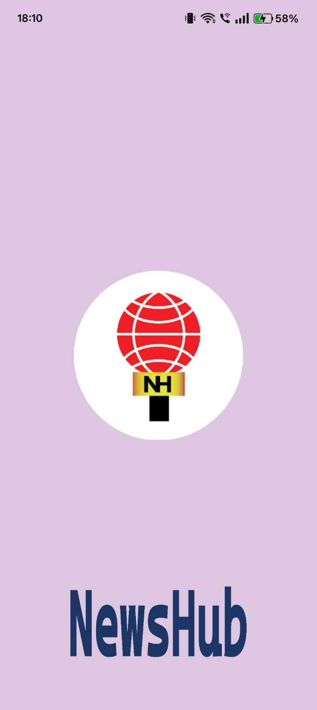
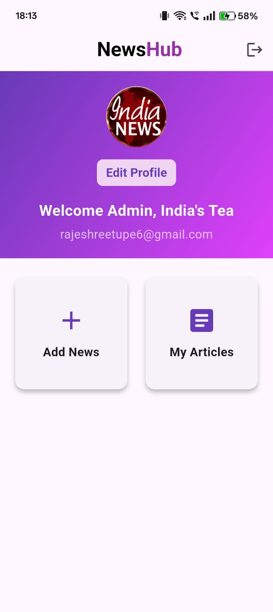
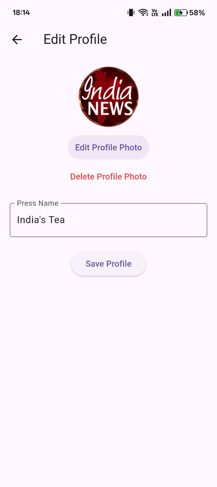
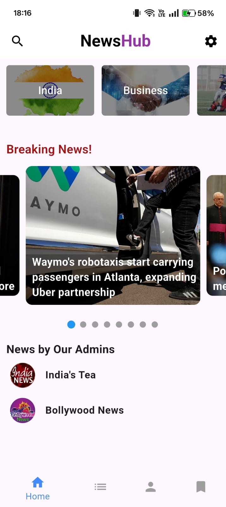
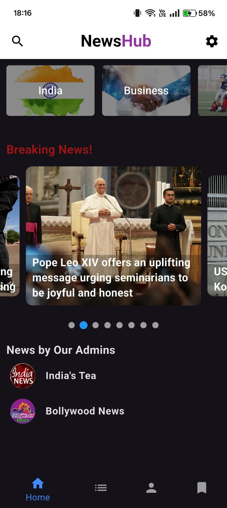
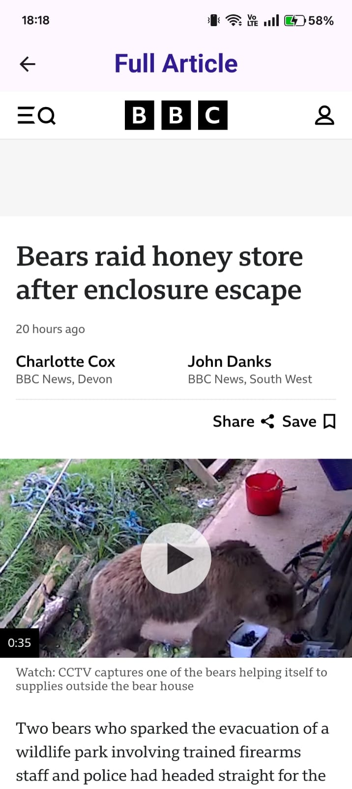
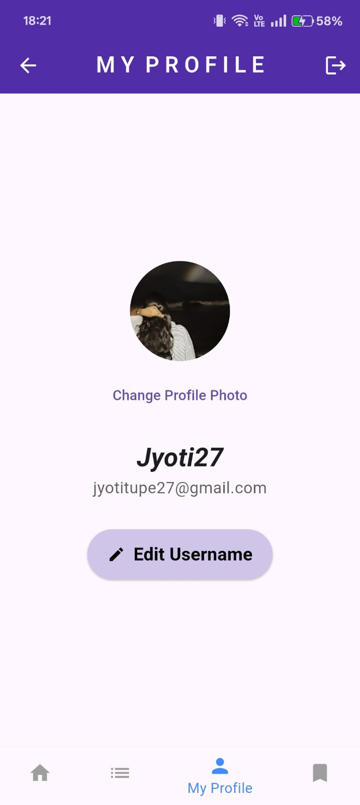
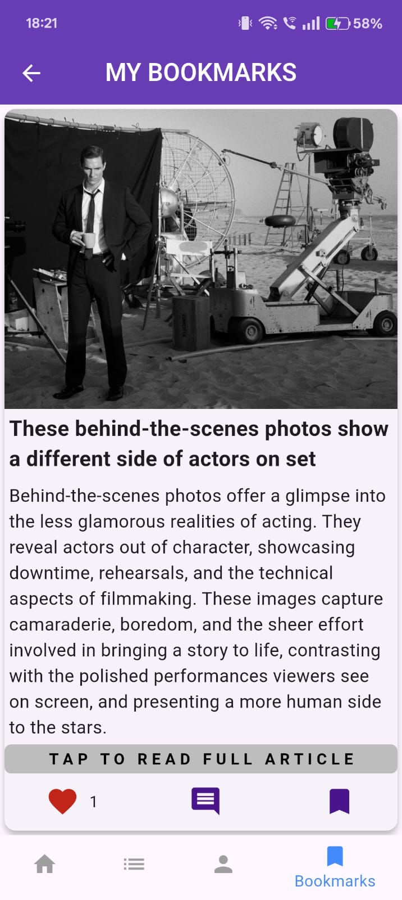
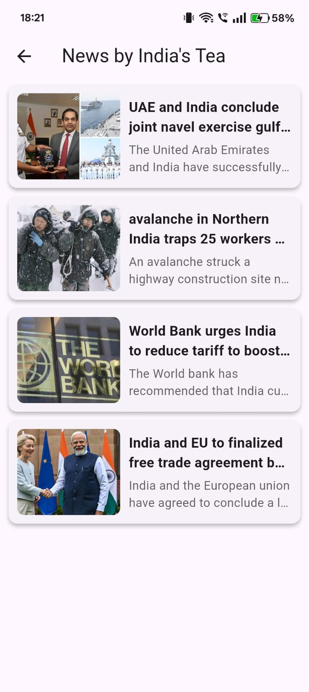

# NEWS APP -(Flutter + FastAPI + Firebase)

This is a **full-stack news app** built with **Flutter (frontend)** and **FastAPI (backend)**.  
It displays summarized news fetched from multiple sources using **NewsAPI** and AI models (Google Gemini + Hugging Face).

---

## Backend (FastAPI)

### Location: `NEWS_APP_backend/`

1. Install dependencies:
   ```bash
   pip install -r requirements.txt
   ```

2. Create `.env`:
   ```env
   NEWS_API_KEY=YOUR_NEWS_API_KEY
   GEMINI_API_KEY=YOUR_GEMINI_API_KEY
   ```

   - Example provided as `.env.example`.
   - Add your own News API key amd Google Gemini API key

3. Run the server:
   ```bash
   uvicorn main:app --host 0.0.0.0 --port 8000 --reload
   ```

---
## Frontend (Flutter)

### Location: `NEWS_APP_flutter/`

1. Install packages:
   ```bash
   flutter pub get
   ```

2. Configure your **News API key**  
   - Create `lib/config/api_key.dart`:
     ```dart
     class ApiKey {
       static const String newsApiKey = "YOUR_NEWS_API_KEY";
     }
     ```
   - **Note:** `api_key.dart` is ignored in `.gitignore`. An example is provided as `api_key_example.dart`. add your own News API Key.

3. Configure your **backend base URL**  
   - In `lib/config/backend_baseurl.dart`:
     ```dart
     // For Android Emulator
     // const String backendBaseUrl = "http://10.0.2.2:8000";

     // For physical device
     const String backendBaseUrl = "http://YOUR_LOCAL_IP:8000";
     ```
   - *Comment/uncomment as needed.*
   - **Tip:** To find your local IP address, open **Command Prompt** and run:
       ```
     ipconfig
     ```
     Look for your **IPv4 Address** and replace `YOUR_LOCAL_IP` with that.
4. Run the app:
   ```bash
   flutter run
   ```

---

## Environment Files

**Backend:**  
- `.env` → contains `NEWS_API_KEY` and `GEMINI_API_KEY`.  
- Do not push `.env` — only `.env.example` is tracked.

**Frontend:**  
- `api_key.dart` → contains `newsApiKey`.  
- Keep it in `.gitignore`. Use `api_key_example.dart` as a template.

**Base URL:**  
- `backend_baseurl.dart` lets you switch between emulator & physical device.

---


## Admin Section

**Demo admin login:**
use this email and password for logging into admin page 
```json

  "email": "demo.admin@example.com",
  "password": "demopassword123"

```
## Disclaimer
This project is for educational/demo purposes only.
Use your own API keys for NewsAPI and Gemini.
Never share real credentials publicly.

## Screenshots of my app:

## Screenshots





















